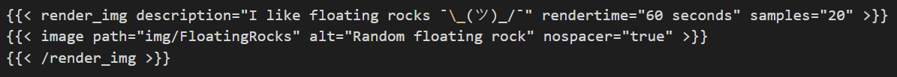
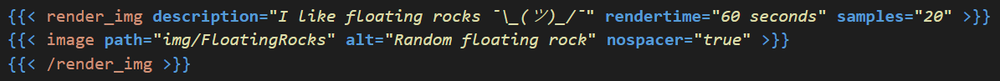

# Hugo Shortcode Syntax Highlighting  

## Features  
Hugo Shortcodes can get complicated when there's more than one or two parameters.  
This extension add some syntax highlighting for Shortcodes, making visual identification of individual pieces easier.  
For example, some shortcodes are below.  

#### Before  

#### After  

## Shortcode suggestions!  
After typing `%` or `<`, user created Shortcodes are suggested.  
These are from Themes or user created, specifically `**/layouts/shortcodes/*.html`  

## Notes  
Positional parameters are not really supported. They just get highlighted like the Shortcode name.